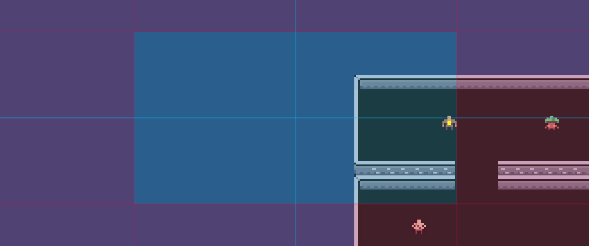

# Práctica FDV Eventos #

## Actividades a realizar:

### 1.Cámara con seguimiento al personaje A. Se debe configurar el seguimiento hacia adelante. Esta cámara es la que debe tener la máxima prioridad.

### 2.Cámara con seguimiento al personaje B. Debe configurarse una zona de seguimiento del personaje B más amplia que la de A.

### 3.Cámara que hace el seguimiento de ambos personajes.

### 4.Crear una zona de confinamiento de A que abarque toda la escena.

### 5.Se debe crear una zona de confinamiento de la cámara B que abarque una parte de la escena.

### 6.Añadir un objeto que genere una vibración en la cámara cuando A choca con el

### 7.Seleccionar un conjunto de teclas que permitan hacer el cambio de la cámara de los personajes a la cámara que sigue al grupo. (Habilitar/Deshabilitar el gameobject de la cámara virtual)

### Extra: Generar una vibración en la cámara cada vez que se pulse la tecla de disparo. Agregar un perfil de ruido a la cámara, y modificar las propiedades de amplitud y frecuencia al component Noise